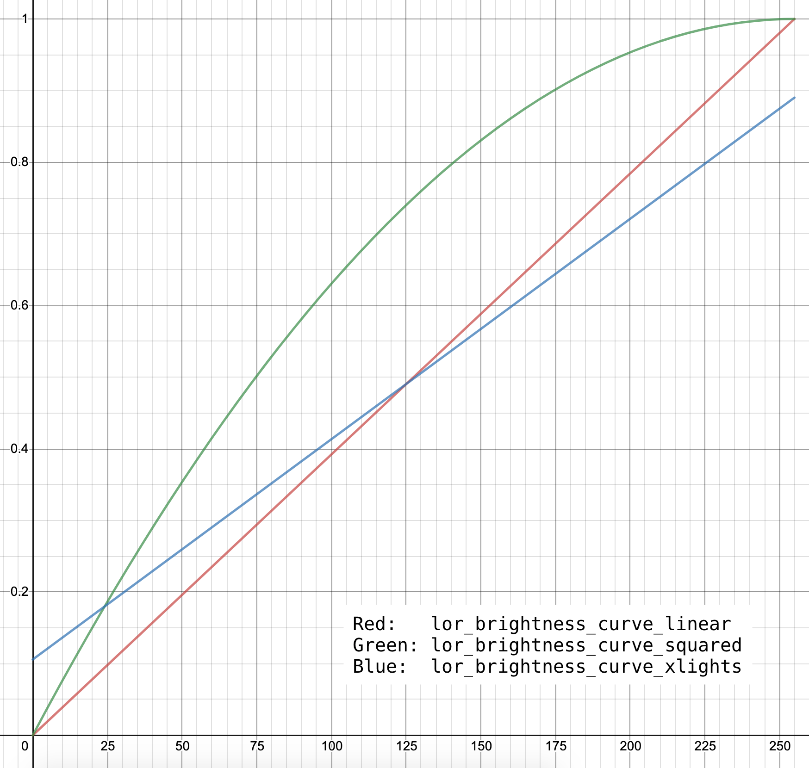

# liblightorama
C90 library implementing the [Light-O-Rama (LOR) communication protocol](https://github.com/Cryptkeeper/lightorama-protocol) alongside related APIs, aiming to reduce usage of magic values and competing encoding & helper methods.

liblightorama strives to be _generally_ portable (for use in microcontrollers) and limits its usage of the standard library, using only the `stdint.h` and `stddef.h` headers (for fixed sized int definitions), with minimal usage of `float`.

Usage of liblightorama assumes existing familiarity with the LOR protocol.

| Header | Purpose |
| --- | --- |
| [`lightorama/protocol.h`](protocol.h) | typedefs, conversion functions and constants for values within the LOR protocol. |
| [`lightorama/io.h`](io.h) | Encoding helper methods for easily building LOR protocol messages. |
| [`lightorama/brightness_curve.h`](brightness_curve.h) | Reimplementation of brightness curve functions to ensure backwards compatibility. |
| [`lightorama/model.h`](model.h) | Automatically generated code representation of the [LOR_DeviceFile.txt](http://www1.lightorama.com/downloads/LOR_DeviceFile.txt). |

## Installation
liblightorama uses [CMake](https://cmake.org/) for building and packaging the library.

1. Generate Makefiles using `cmake .`
2. If outdated or missing, use `generate_model_h.sh` to generate an updated `model.h`
3. Compile the library using `make`
4. Optionally install the headers and compiled archive using `make install`

If optionally installed, `install_manifest.txt` will be created, containing the installed file paths for easy removal.

## Usage Examples
Turn off all channels on unit `0x01`.

_Tip:_ Changing `unit_id` to `LOR_UNIT_ID_BROADCAST` would turn off all channels on ALL units.

```C
#include <lightorama/io.h>
#include <lightorama/protocol.h>
...

const lor_unit_t unit_id = 0x01;

unsigned char msg[25];
size_t len = lor_write_unit_action(unit_id, LOR_ACTION_UNIT_OFF, msg);
```

Set channel 8 on unit `0x01` to 50% brightness. This uses the `lor_brightness_curve_linear` brightness curve, but you can use other brightness curves (or write your own).

```C
#include <lightorama/brightness_curve.h>
#include <lightorama/io.h>
#include <lightorama/protocol.h>
...

// Set channel 8 on unit 0x01 to 50% brightness
const lor_unit_t unit_id = 0x01;
const LORChannel channel = lor_channel_of(7); // channels start at 0
const lor_brightness_t brightness = lor_brightness_curve_linear(0.5); // 50% brightness

unsigned char msg[25];
size_t len = lor_write_channel_set_brightness(unit_id, channel, brightness, msg);
```

Fade channels 1-4 from 50% to 100% brightness in 5 seconds on unit `0x01`. This uses the `lor_brightness_curve_squared` to demonstrate alternate brightness curve functionality.

_Tip:_ Use `lor_channel_of_mask16` for constructing 16 bit channel masks. Channel mask stiching functionality is available using the `chain_index` parameter.

```C
#include <lightorama/brightness_curve.h>
#include <lightorama/io.h>
#include <lightorama/protocol.h>
...

// Fade channels 1-4, 50% to 100% brightness, in 5 seconds on unit 0x01
const LORChannel channel_mask = lor_channel_of_mask8(0x0F, 0); // 0b00001111, 0 = no chain_index value
const lor_brightness_t from = lor_brightness_curve_squared(0.5); // 50% brightness
const lor_brightness_t to = lor_brightness_curve_squared(1); // 100% brightness
const lor_duration_t duration = lor_duration_of(5); // 5 seconds

unsigned char msg[25];
size_t len = lor_write_channel_fade(0x01, channel_mask, from, to, duration, msg);
```

`io.h` additionally exposes several encoding methods, allowing you to circumvent the helper methods and manually construct message structures as desired, without needing to reimplement the data types.

## Memory Allocations
liblightorama does not allocate any memory internally, and requires a `unsigned char *` be passed to functions for writing to memory. All write related functions return a `size_t` value indicating the length of the data written (in bytes). Please track this value alongside the memory allocation size to ensure write calls do not overflow.

To help size your buffers, consider that while not absolute and potentially volatile, even the largest write call (`lor_write_channel_fade_with`) will not write more than 11 bytes.

## Brightness Curves
Brightness curves are responsible for converting a normalized brightness value [0, 1] to a [LOR protocol brightness value](https://github.com/Cryptkeeper/lightorama-protocol#brightness). The purpose of different brightness curves is to easily modify the visual appearance of brightness changes without redefining the underlying normalized values.

### Pre-implemented Brightness Curves
| Function | Description |
| --- | --- |
| `lor_brightness_curve_linear` | Encodes the normalized value as its direct LOR protocol equivalent value without changes. |
| `lor_brightness_curve_squared` | A smoothed version of `lor_brightness_curve_linear` designed to emphasis changes in brightness values. |
| `lor_brightness_curve_xlights` | A simplified reimplementation of the [xLights brightness curve](https://github.com/smeighan/xLights/blob/master/xLights/outputs/LOROutput.cpp#L46-L59), a modified linear brightness curve. |

[](brightness_curves.png)

_While not visible in the graph, `lor_brightness_curve_xlights` will explicitly use a brightness of 0% and 100% at the normalized brightness inputs of 0 and 1 respectively._

### Custom Brightness Curves
Any brightness curve may be implemented assuming it adheres to the `lor_brightness_curve_t` function signature: 
`lor_brightness_t (*lor_brightness_curve_t)(float normal)`

Each brightness curve is designed to return a `lor_brightness_t` object representing the LOR protocol equivalent value of the normalized input, as adapted by the curve. Several consts have been defined within `protocol.h` to avoid using magic numbers in your implementations. See [`brightness_curve.c`](brightness_curve.c) for implementation examples.

## Compatibility
liblightorama is implemented following [this documentation](https://github.com/Cryptkeeper/lightorama-protocol), which was built through reverse engineering efforts. As such, liblightorama has limited compatibility testing and may not work with your hardware. The current library functionality offerings have been tested with the `LOR1602Wg3` & `CTB16PCg3` hardware models.

## License
See [LICENSE](LICENSE).
